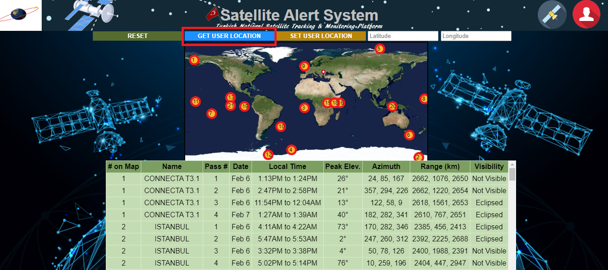
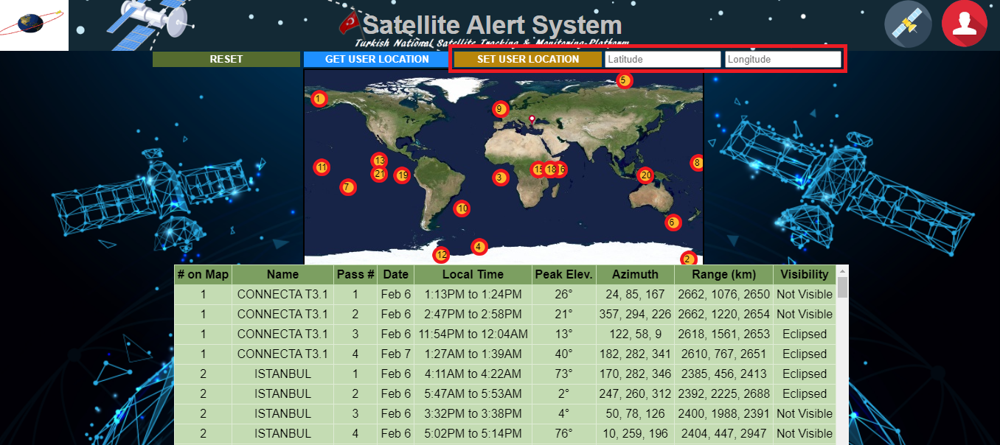
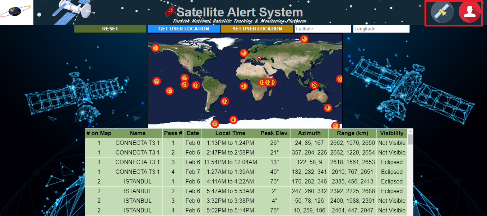

# Satellite Alert System

Welcome to the Satellite Alert System repository! This project provides a real-time satellite tracking system with features to visualize satellite orbits and generate pass tables. Below is an in-depth guide on how to use, deploy, and set up the system.

## File Structure

1. **Home Page (`index.js`):**
   - The main webpage of the Satellite Alert System.
   - Provides a user interface to interact with the satellite tracking system.
   - Displays a map with satellite markers and pass information.

2. **Style Sheet (`orbtrak.css`):**
   - Contains the styles and layout configurations for the user interface.
   - Enhances the visual presentation of the Satellite Alert System.

3. **Functionality (`orbtrak.js`):**
   - Implements the core functionality of the satellite tracking system.
   - Includes features such as starting tracking, updating satellite positions, and generating pass tables.
   - Utilizes the PredictLib.js library for satellite tracking computations.

4. **Satellite Tracking Library (`predictlib.js`):**
   - The SGP4 library used for satellite tracking predictions.
   - Powers the computation of satellite positions based on Two-Line Element (TLE) data.

5. **TLE Data (`tle.js`):**
   - Contains saved Two-Line Element (TLE) data for satellites.
   - Provides essential orbital parameters required for satellite tracking.


### Prerequisites

- Web browser with JavaScript support

### Usage Guide

- The red pin on map shows the user location on map.
- The user location intially is set to Lat Long Coordinates of Istanbul.
- The red circled dots on the map are position coordinates of satellites.
- Satellite position coordinated are updated after every 5 secs.
- Table below the map gives the passes information specific to the user location.
- Click on RESET Button to reset the page any time.
   

- Click on GET USER LOCATION Button to automatically get your present location updated on map and calculate the passes data accordingly.
   

- Click on SET USER LOCATION Button after entering the lat long in the input fields to manually update your location on map and calculate the passes data accordingly.
   

- Click on these image Buttons to view the ABOUT and CONTACT information
   
  
### Installation

1. Clone the repository:
   ```bash
   git clone https://github.com/Shehabov/Satellite-Alert-System.git

### Getting Started

- Open the index.html file in your web browser
- Upon opening the home page (index.html), the Satellite Alert System will be displayed
- Explore the interactive map with satellite markers representing real-time positions
- Click on the information icons or markers for detailed satellite pass information
- The pass table provides a list of upcoming satellite passes with relevant details

## GitHub Deployment Instructions

### Fork the Repository

    Fork the Repository:
        Go to the Satellite Alert System GitHub repository.
        Click on the "Fork" button in the top right corner of the page.
        This creates a copy of the repository in your GitHub account.

### Clone the Repository

    Clone the Repository:
        Open a terminal or command prompt on your local machine.
        Run the following command to clone your forked repository:

        bash

        git clone https://github.com/[YourUsername]/Satellite-Alert-System.git

        Replace [YourUsername] with your GitHub username.

### Update Remote URL (Optional)

    Update Remote URL (Optional):
        Navigate to the cloned repository:

        bash

        cd Satellite-Alert-System

### Verify the remote URL:

      bash

      git remote -v

### If the URL is pointing to your fork, you can skip this step. If not, update the remote URL:

      bash

      git remote set-url origin https://github.com/[YourUsername]/Satellite-Alert-System.git

### GitHub Pages Configuration

    Enable GitHub Pages:
        In your forked repository on GitHub, go to the "Settings" tab.
        Scroll down to the "GitHub Pages" section.
        Under "Source," select the main branch.
        GitHub Pages will now be enabled, and your site will be published at https://[YourUsername].github.io/Satellite-Alert-System/.

### Access Deployed Site

    Access Deployed Site:
        Once GitHub Pages has finished building your site, you can access it at the provided URL.
        It might take a few minutes for the changes to reflect.

### Updating the Deployed Site

    Update and Commit Changes:
        Make any desired changes to your local clone.
        Commit the changes:

        bash

    git add .
    git commit -m "Update site with new features"

### Push Changes:

    Push the changes to your fork on GitHub:

    bash

        git push origin main

    GitHub Pages Auto-Update:
        GitHub Pages will automatically rebuild and update your site based on the changes made to the main branch.

### Custom Domain (Optional)

    Custom Domain (Optional):
        If you have a custom domain, you can configure it in the "Custom domain" section in GitHub Pages settings.
        Follow GitHub's instructions for setting up a custom domain: Configuring a custom domain for your GitHub Pages site.

Now the project should be successfully deployed and accessible via GitHub Pages. Feel free to reach out if you encounter any issues or have further questions!

## Resources

 - PredictLib.js: https://www.qsl.net/kd2bd/predict.html
 - NORAD Archives: http://celestrak.org/NORAD/archives/

## Acknowledgments
      Special thanks to John A. Magliacane (KD2BD) for the PredictLib.js library.

You are welcome to contribute, report issues or provide feedback. Happy satellite tracking!
